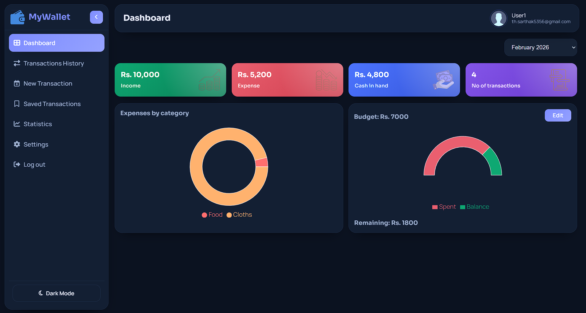
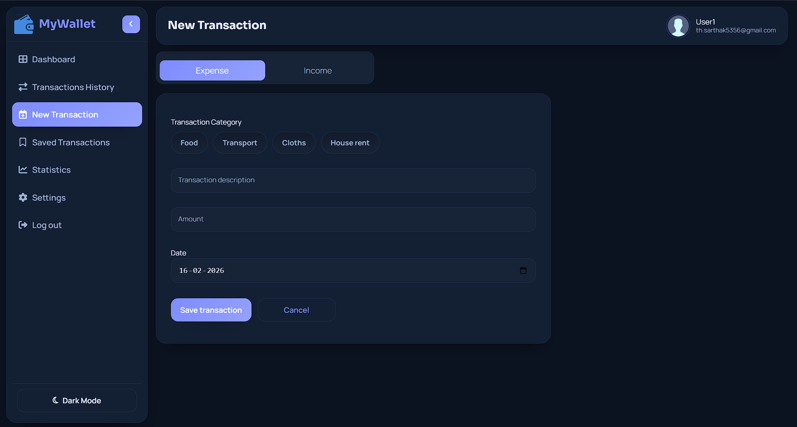
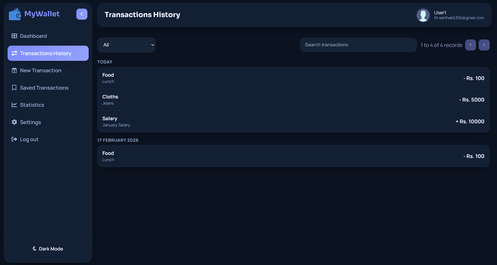
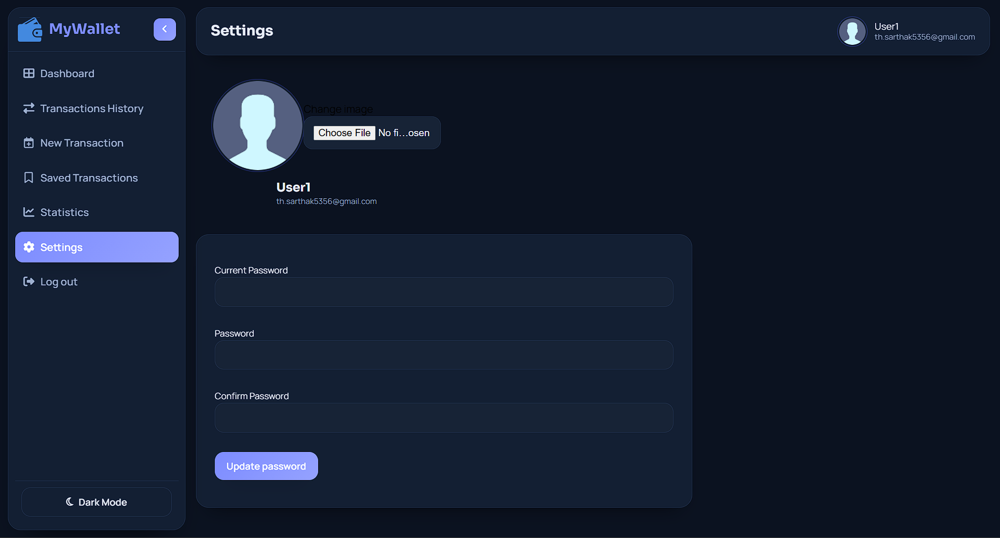
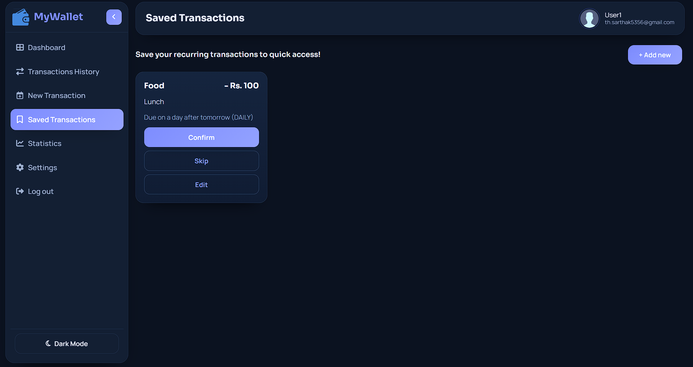

# Fullstack Expense Tracker

Formal, production-ready expense tracker combining a Spring Boot backend and a React frontend.

## Project Summary

This repository implements a full-stack personal finance application for tracking incomes, expenses, user profiles, and reports. The backend is built with Java and Spring Boot; the frontend is a React single-page application. The application supports user authentication, role-based access (admin/user), transaction management, profile uploads, and basic analytics.

## Features

- User registration, login (JWT-based), and role-based authorization
- CRUD operations for transactions (expense/income)
- User profile management and profile image uploads
- Dashboard with expense vs income summary, categories, and pagination
- Admin services for user and data management

## Tech Stack

- Backend: Java, Spring Boot, Maven
- Frontend: React, Create React App
- Authentication: JWT
- Build artifacts: Maven target for backend, `frontend/build` for production frontend

## Repository Layout

- `backend/` — Spring Boot application (Java + Maven)
- `frontend/` — React application (source in `frontend/src`, production build in `frontend/build`)
- `uploads/` — stored user-uploaded files (profile images)

## Prerequisites

- Java 11+ (or the version used by the backend project)
- Maven 3.6+
- Node.js 14+ and npm or yarn

## Backend — Setup & Run (Development)

1. Open a terminal in `backend/`.
2. Build and run with Maven (development):

```powershell
cd backend
./mvnw spring-boot:run
```

On Windows use `mvnw.cmd` if needed:

```powershell
mvnw.cmd spring-boot:run
```

The backend listens on the port configured in `src/main/resources/application.properties` (commonly 8080).

## Backend — Build (Production JAR)

```powershell
cd backend
./mvnw clean package -DskipTests
```

The resulting JAR will be under `backend/target/` (e.g. `expenseTracker-0.0.1-SNAPSHOT.jar`).

## Frontend — Setup & Run (Development)

1. Open a terminal in `frontend/`.
2. Install dependencies and start dev server:

```bash
cd frontend
npm install
npm start
```

By default the React dev server runs on port 3000. Configure the frontend to proxy API requests to the backend if needed (see `package.json` and `src` code).

## Frontend — Build (Production)

```bash
cd frontend
npm run build
```

The static production assets will be in `frontend/build` (already present in this repo under `frontend/build/`). These can be served by the backend or a static hosting provider.

## Configuration / Environment

Typical backend properties (set in `src/main/resources/application.properties` or via environment variables):

- `server.port` — backend port
- `spring.datasource.url` — JDBC datasource
- `spring.datasource.username` / `spring.datasource.password`
- `jwt.secret` — JWT signing secret (keep secure)
- `file.upload-dir` — directory for profile uploads (defaults to `uploads/`)

Ensure secrets (JWT, DB credentials) are provided via secure environment variables in production.

## API Overview (Common Endpoints)

This is a summary — consult backend controllers for full details.

- `POST /api/auth/register` — register new user
- `POST /api/auth/login` — authenticate and receive JWT
- `GET /api/users/me` — get current user profile
- `PUT /api/users/me` — update profile
- `POST /api/users/me/photo` — upload profile image
- `GET /api/transactions` — list transactions (supports pagination and filters)
- `POST /api/transactions` — create transaction
- `PUT /api/transactions/{id}` — update transaction
- `DELETE /api/transactions/{id}` — delete transaction
- `GET /api/admin/**` — admin-only operations

Response shapes, query parameters, and request DTOs are defined in the backend source under `backend/src/main/java`.

## Running Tests

Backend (Maven):

```powershell
cd backend
./mvnw test
```

Frontend (if tests configured):

```bash
cd frontend
npm test
```

## Deployment Notes

- Build backend JAR with Maven and front-end static files with `npm run build`.
- Serve `frontend/build` contents via the backend (static resources) or a CDN/static host.
- Provide environment variables for DB, JWT secret, and any cloud storage or SMTP settings.

## File Uploads and Persistence

Uploaded profile images are stored in the `uploads/` directory. Confirm appropriate file permissions and backups in production.

## Contributing

Contributions are welcome. Suggested workflow:

1. Fork the repository
2. Create a feature branch
3. Add tests for new behavior
4. Open a pull request with a clear description

Follow the existing code style and run tests before submitting.

## Screenshots

Screenshots below show the main views: login, dashboard, creating a transaction, transaction history, statistics, settings, and saved-transaction confirmation.









## Author

Ravi Singh

## Contact / Further Information

For questions or support, open an issue in this repository or contact the maintainers listed in project metadata.

