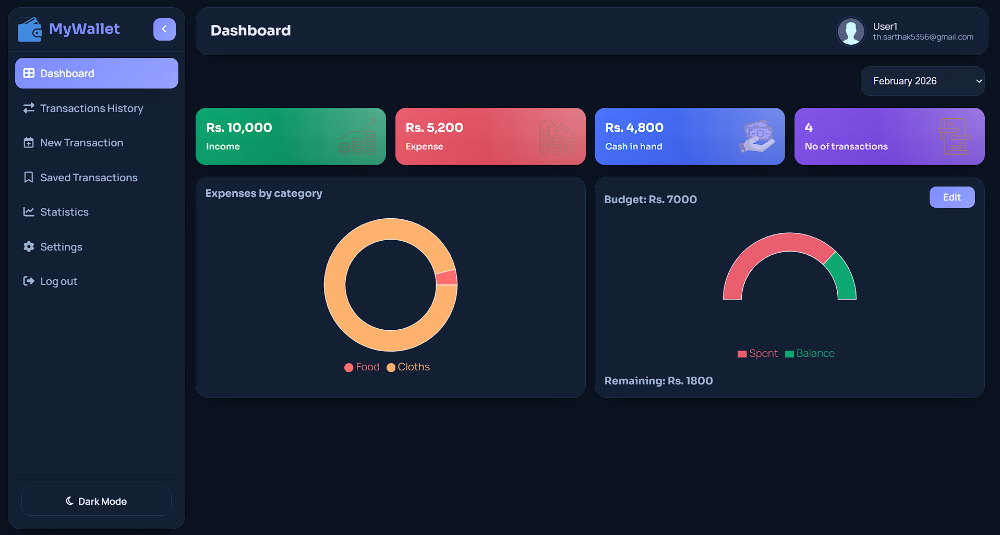
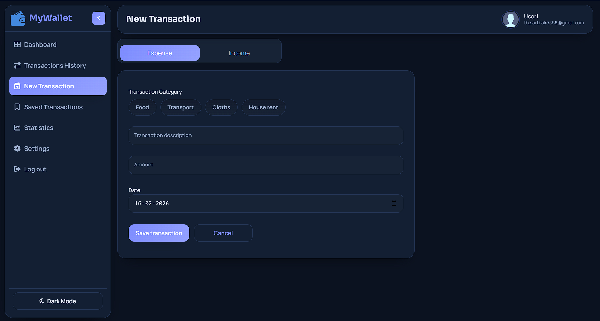
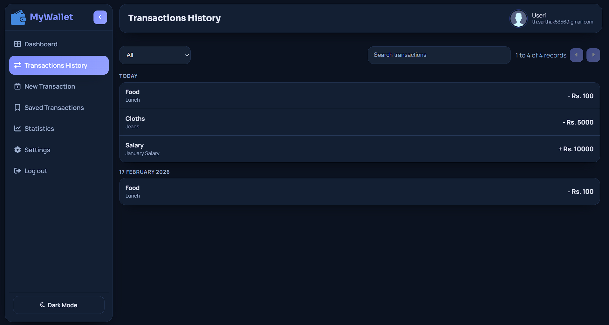
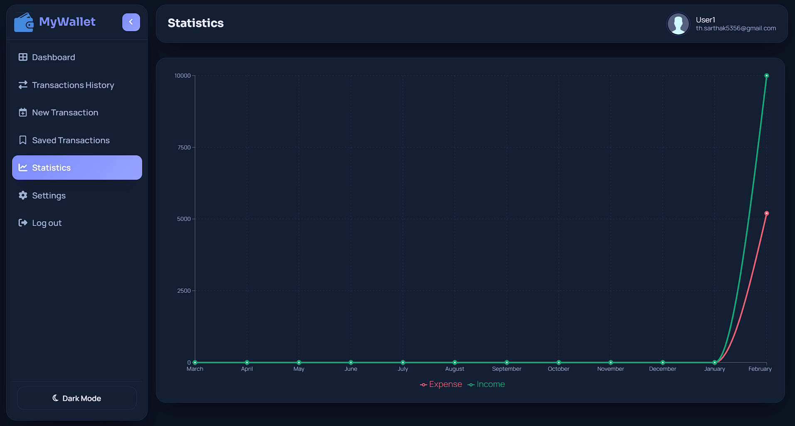
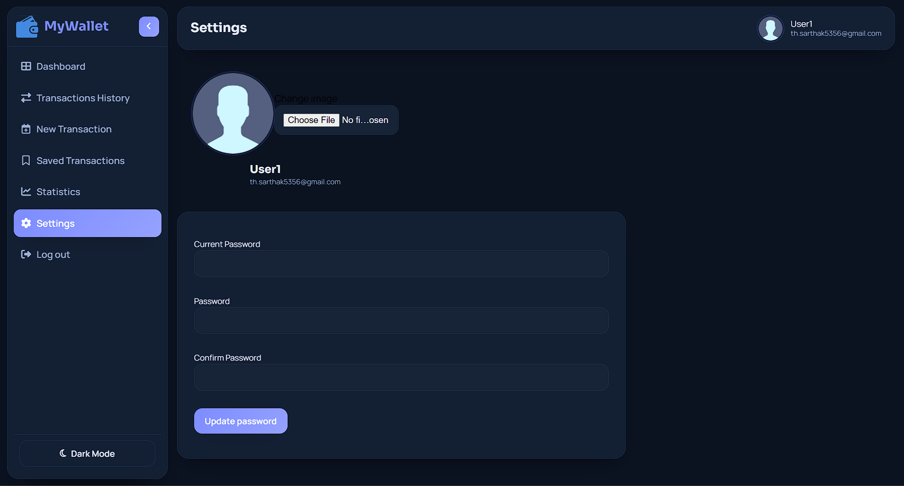
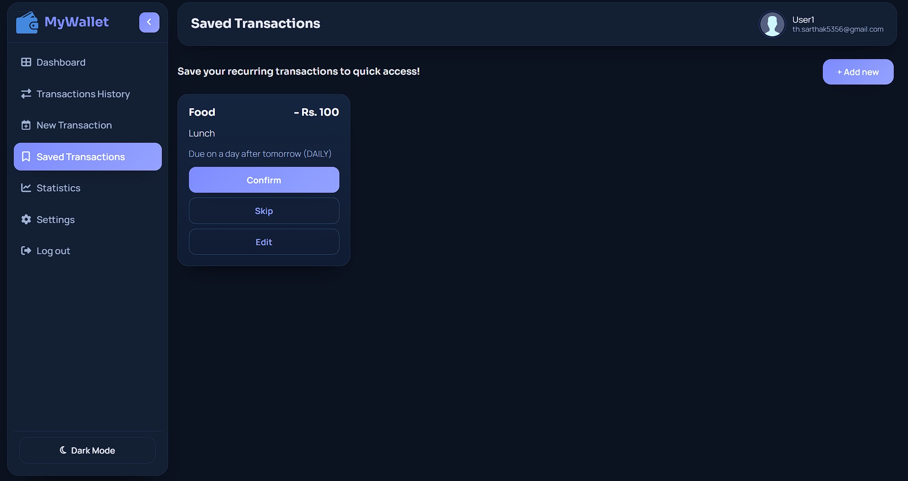

# Fullstack Expense Tracker

Expense tracker application with a Spring Boot backend and a React frontend.

## Tech Stack

- Backend: Java, Spring Boot, Maven
- Frontend: React, Create React App
- Authentication: JWT

## Project Structure

- `backend/` - Spring Boot API
- `frontend/` - React app
- `Screenshots/` - project screenshots

## Live Deployment

- Frontend: `https://frontend-production-6a91.up.railway.app`
- Backend: `https://backend-production-ab1e.up.railway.app`

## Render Deployment

This repo now includes [`render.yaml`](render.yaml) so you can deploy both services on Render.

Frontend Render env var:

- `REACT_APP_API_BASE_URL=https://your-backend-service.onrender.com/mywallet`

Backend Render env vars:

- `SPRING_DATASOURCE_URL`
- `SPRING_DATASOURCE_USERNAME`
- `SPRING_DATASOURCE_PASSWORD`
- `APP_JWT_SECRET`
- `SPRING_MAIL_USERNAME`
- `SPRING_MAIL_PASSWORD`
- `APP_CORS_ALLOWED_ORIGIN_PATTERNS=https://your-frontend-service.onrender.com`

Backend health check:

- `https://your-backend-service.onrender.com/health`

## Prerequisites

- Java 21
- Maven 3.6+
- Node.js and npm

## Quick Run Commands

Open the project root folder in PowerShell, then use these commands.

Terminal 1 - Backend:

```powershell
$env:SPRING_DATASOURCE_PASSWORD="Ravi@1234"
$env:APP_JWT_SECRET = "change-this-development-jwt-secret-before-production-use"
cd backend
mvn spring-boot:run
```

Terminal 2 - Frontend:

```powershell
cd frontend
cmd /c npm start
```

After both servers start, open:

```text
http://localhost:3000
```

## Backend Run Command

Open a terminal in the project root and run:

```powershell
$env:SPRING_DATASOURCE_PASSWORD="your_mysql_password"
$env:APP_JWT_SECRET="change-this-development-jwt-secret-before-production-use"
cd backend
mvn spring-boot:run
```

The backend runs on:

- `http://localhost:8080`

For this local project setup, the backend expects MySQL to have:

- Database: `expensetracker`
- Username: `expense_user`
- Password: provided through `SPRING_DATASOURCE_PASSWORD`

Health check:

```powershell
Invoke-WebRequest -UseBasicParsing http://localhost:8080/health
```

## Frontend Run Command

Open another terminal and run:

```powershell
cd frontend
cmd /c npm install --ignore-scripts
cmd /c npm start
```

The frontend runs on:

- `http://localhost:3000`

## Build Commands

Backend:

```powershell
cd backend
mvn clean package -DskipTests
```

Frontend:

```powershell
cd frontend
cmd /c npm run build
```

## Run Both Locally

Use two terminals.

Terminal 1:

```powershell
$env:SPRING_DATASOURCE_PASSWORD="your_mysql_password"
$env:APP_JWT_SECRET="change-this-development-jwt-secret-before-production-use"
cd backend
mvn spring-boot:run
```

Terminal 2:

```powershell
cd frontend
cmd /c npm install --ignore-scripts
cmd /c npm start
```

Then open:

- Frontend: `http://localhost:3000`
- Backend health: `http://localhost:8080/health`

## Notes

- If port `8080` is busy, check it with:

```powershell
netstat -ano | findstr :8080
```

- If port `3000` is busy, check it with:

```powershell
netstat -ano | findstr :3000
```

- Local frontend uses backend base URL:
  - `http://localhost:8080/mywallet`
- Use `cmd /c npm ...` on Windows PowerShell if direct `npm` commands are blocked by execution policy.
- Protected backend APIs require JWT authentication. Login first, then frontend sends `Authorization: Bearer <token>` automatically.

## Screenshots








